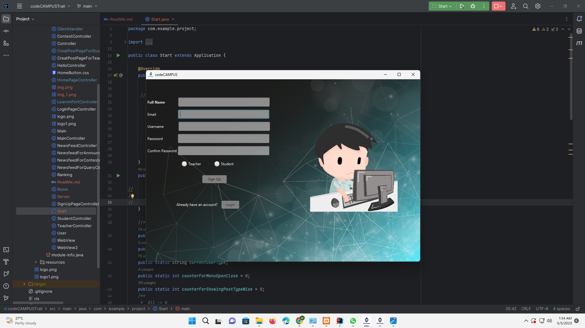

# code**CAMPUS**
### This is our Advanced Object-Oriented Programming(AOOP) Project.

## About this Project

This Project Actually Based on **A Competitive Programming (UIU CP Community)**
Two Types of user can use this Application(web based).They can take participate in Programming Contest .Student can ask their necessary Question in "Query", can saw the updated news in News section etc.Teacher Can announce the contest date ,able to share important link & students can view it easily.Also , a student can use multiple Programming based and others important site in this Application. Our "C/C++" IDE is in build in Progress.

### **HomePage**

### **ChatView**

### **LearningPortal**

### **CP**

#### **Thanks to my Teammate**

###  Md. Azizul Hoque Noman (mnoman338) &
### Tarek Rahman (tarekrahamn)